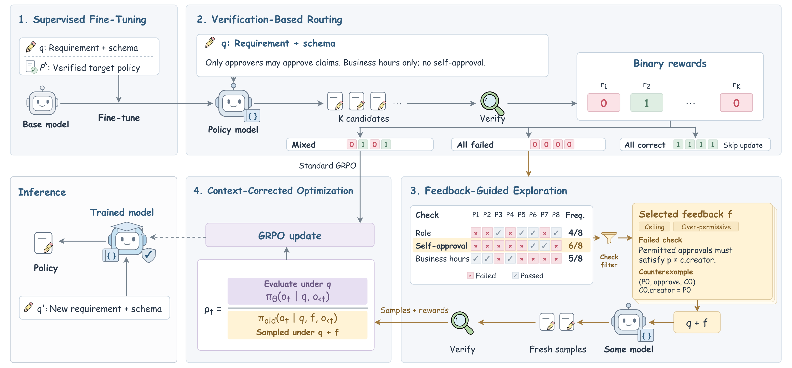

# RAISE: Reinforcing Access Control Policy Synthesis in LLMs via Symbolic Evaluation

This repository contains the minimal code implementation of **RAISE**
(*Reinforcing Access Control Policy Synthesis in LLMs via Symbolic Evaluation*).
RAISE trains a policy model with a Cedar verifier: all-failure rollout groups
are routed to fresh generations conditioned on selected failed-check feedback,
and successful guided candidates are optimized under the original prompt.

## Method overview

The figure below summarizes the four stages of RAISE. Supervised fine-tuning
teaches the model to generate verified Cedar policies. Verification-based
routing then separates mixed-reward, all-failure, and all-correct rollout
groups. All-failure groups receive selected failed-check descriptions and
counterexamples for fresh feedback-guided exploration. Finally, the resulting
candidates are evaluated under the original requirement and schema using the
context-corrected objective. At inference time, the trained model generates a
policy from the requirement and schema without verifier feedback.

[](raise-method.pdf)

The full-resolution diagram is available as [`raise-method.pdf`](raise-method.pdf).

The release intentionally contains source code and the method overview figure
only. It does not contain model weights, training datasets, checkpoints, logs,
generated runs, or evaluation results.

## Layout

```text
src/raise_method/
  feedback.py       deterministic counterexample formatting
  routing.py        group routing and context-preserving advantages
  reward.py         exact binary Cedar reward
  loss.py           context-corrected policy loss
  rollout.py        veRL feedback-guided rollout adapter
  trainer.py        veRL trainer adapter
  verifier/         Cedar validate/symcc wrapper
```

The repository directory is named `raise`; the importable Python package is
`raise_method` because `raise` is a Python keyword.

## CPU checks

```bash
python -m pip install -e .
pytest
```

The CPU tests exercise the feedback reducer, routing invariants, and policy
extraction. Running the verifier or distributed trainer additionally requires
the Cedar CLI, cvc5, a compatible veRL checkout, a model, and scenario bundles
containing `schema.cedarschema`, `verification_plan.py`, and `references/`.

Set `CEDAR` and `CVC5` to the two executable paths before scoring policies.
The veRL configuration in `src/raise_method/configs/raise.yaml` expects
`RAISE_ROOT`, `RAISE_MODEL`, `RAISE_DATA`, and `RAISE_RUN`.

## Method entry points

- `raise_method.reward.score_candidate()` returns the exact verifier result.
- `raise_method.routing.select_failed_checks()` selects feedback targets.
- `raise_method.rollout.RaiseAgentLoopManager` performs fresh guided rollout.
- `raise_method.loss.raise_actor_loss()` applies the original-context update.
- `raise_method.main` is the veRL launch entry point.

No result table or training record is part of this code release; experiment
artifacts should be stored separately from the repository.
